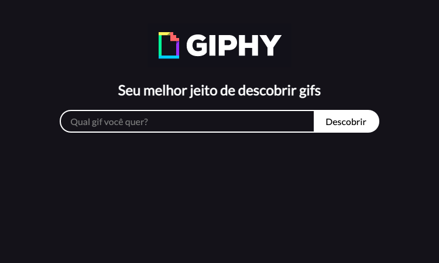
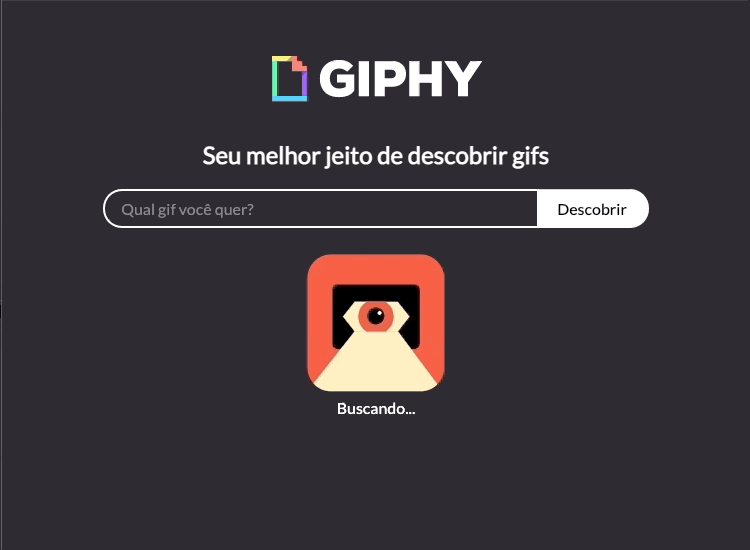
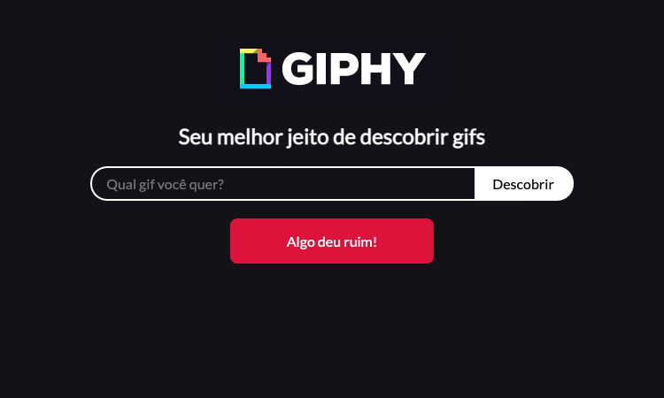

# Desafio Frontend #001

## 🏴‍☠ AVISO

Nesse desafio eu não vou passar muitos dados, links ou qualquer tipo de passo a passo de como fazer o projeto.

O objetivo disso é forçar você a pesquisar e construir um produto seu, apenas usando a ideia apresentada aqui ✌️.

## 🤔 Qual o objetivo?

Buscar gifs aleatórios baseado no que foi digitado.

## Nosso layout

## 🤖 Algumas regras

- Se o usuário tentar buscar sem digitar nada, tem que mostrar o erro
- Se a api ter algum problema, tem que mostrar o erro

## 👀 Algumas dicas

- Usei uma fonte do `Google Fonts` para melhorar o texto.
- Usei a biblioteca de animações do `Lottie` o carregamento.
- Usei a API do `Giphy` para buscar os gifs aleatórios.
- O próprio `Giphy` disponibiliza os seus logos 👍
